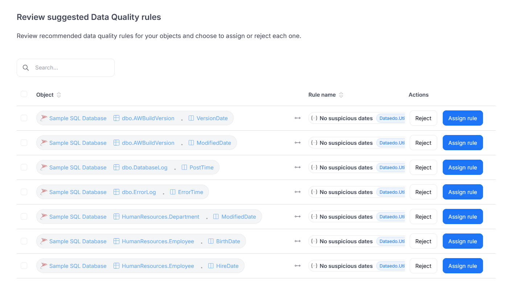

# Suggested Data Quality Rules

Data Quality rules are key guidelines for effective data validation, as they define what makes specific data acceptable. You can select them yourself, but Dataedo also provides automatic suggestions on the basis of column names and their match to known patterns.

To view the suggested rules, navigate to column details and scroll to the bottom of the **Data Quality** tab. As an example, for this column, the **Valid email address** rule is suggested. It checks whether the values follow a valid email format.

:::info
Not all columns have rule suggestions available. 
:::

To view bulk rule suggestions for all objects, navigate to the **Data Quality** tab in the main menu (it's under the **Data Governance** section) and go to the **Suggestions** tab. There, you can assign or reject them.

For more information on Data Quality rules, go to [Rule Instances](https://docs.dataedo.com/data-quality/rule-instances).

## Examples

The table below shows several examples of columns and rules that may be provided as suggestions.

<table>
  <thead>
    <tr>
      <th>Category</th>
      <th>Column Name Notes</th>
      <th>Suggested Rules</th>
    </tr>
  </thead>
  <tbody>
    <tr>
      <td>📧 Email</td>
      <td>Contains <code>%mail%</code></td>
      <td>Valid email address</td>
    </tr>
    <tr>
      <td>🪪 Government IDs</td>
      <td>For example: <code>%ssn%</code>, <code>%nip%</code>, <code>%pesel%</code>, <code>%ein%</code></td>
      <td>
        <ul>
          <li>Valid US SSN (for <code>ssn</code>, <code>ssn_%</code>, or <code>%_ssn</code>)</li>
          <li>Valid Polish NIP (for <code>nip</code>, <code>%nip%</code>, or <code>nip%</code>)</li>
          <li>Valid Polish PESEL (for <code>pesel</code>)</li>
          <li>Valid US EIN (for <code>ein</code>)</li>
        </ul>
      </td>
    </tr>
    <tr>
      <td>📅 Dates</td>
      <td>Contains: <code>created_at</code>, <code>updated_at</code>, <code>timestamp</code>, <code>expiry_date</code></td>
      <td>
        <ul>
          <li>Future dates exist (e.g., for <code>%expiry%date%</code>)</li>
          <li>Not in future (e.g., for <code>%created%at%</code> or <code>%modified%at%</code>)</li>
          <li>Is fresh (checks if the column contains values based on a specific freshness interval, e.g., for <code>%last%updated%</code>)</li>
          <li>No suspicious dates (checks if the column values don't contain implausible dates, for all dates)</li>
        </ul>
      </td>
    </tr>
    <tr>
      <td>🌐 URLs and IPs</td>
      <td>Contains: <code>url</code>, <code>website</code>, <code>link</code>, <code>ip_address</code></td>
      <td>
        <ul>
          <li>Valid HTTP address</li>
          <li>Valid IPv4 address (for IDs)</li>
        </ul>
      </td>
    </tr>
    <tr>
      <td>🌍 Postal codes</td>
      <td>Contains <code>zip_code</code></td>
      <td>Valid US zip code (depends on the country)</td>
    </tr>
    <tr>
      <td>🔢 Identifiers and product codes</td>
      <td>For example: <code>asin</code>, <code>iban</code>, <code>imei</code>, <code>vin</code>, <code>cusip</code>, <code>duns</code></td>
      <td>
        <ul>
          <li>Valid ASIN (for <code>asin</code>)</li>
          <li>Valid IBAN (for <code>iban</code>)</li>
          <li>Valid IMEI (for <code>imei</code>)</li>
          <li>Valid VIN (for <code>vin</code>)</li>
          <li>Valid CUSIP (for <code>cusip</code>)</li>
        </ul>
      </td>
    </tr>
    <tr>
      <td>🧾 JSON or metadata</td>
      <td>Contains: <code>%json%</code>, <code>%payload%</code></td>
      <td>Valid JSON</td>
    </tr>
  </tbody>
</table>