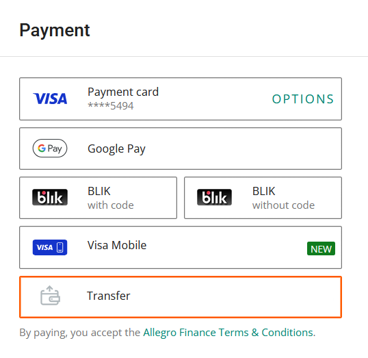
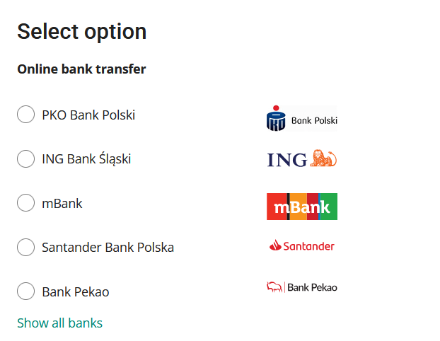
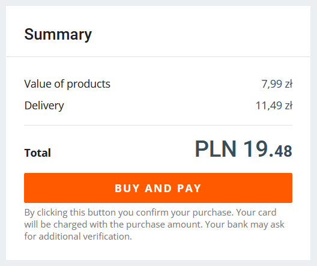
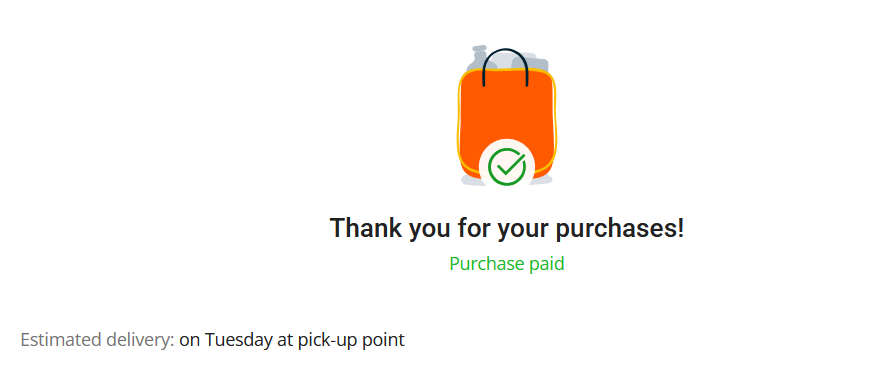

After you've selected your item(s) and provided delivery information, follow these steps to complete your purchase with a bank transfer:

1. In the **Payment** section, select **Transfer**.

    

2. Select your bank from the list. 

    

The available banks are:
- PKO Bank Polski
- ING Bank Śląski
- mBank
- Santander Bank Polska
- Bank Pekao
- Millennium Bank
- Banki Spółdzielcze
- Alior Bank
- BNP Paribas
- Credit Agricole
- Inteligo
- VeloBank
- Bank Pocztowy
- Citi Handlowy
- Nest Bank

:::info
In the list, you can also select a standard/postal transfer, which is useful for people who don't have a bank account or can't pay online. If you select this option and click **Buy and pay**, you will see transfer details you need to complete the transfer. You can then make the transfer at a post office.
:::

2. In the **Summary**, click **Buy and pay**. 

    

3. You will be redirected to your bank's website. Log in and follow the instructions to order a transfer. When you finish, you will automaticaly be logged out and redirected back to Allegro.

    If the payment is successful, you'll see a *Thank you for your purchase(s)!* message and an estimated delivery date.

    