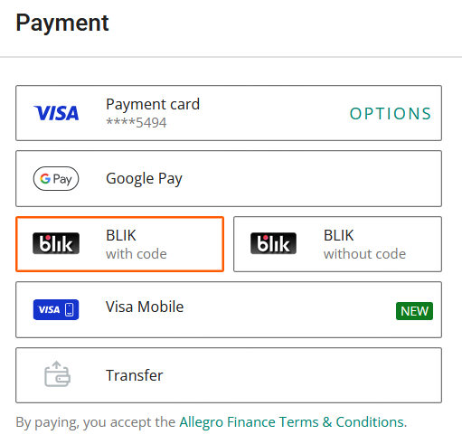
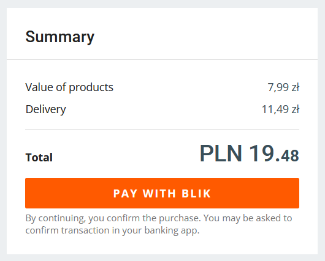
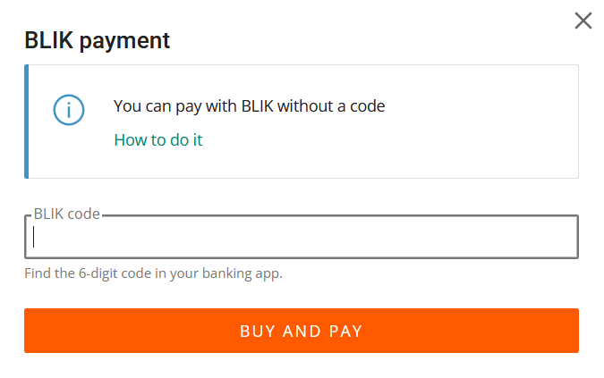
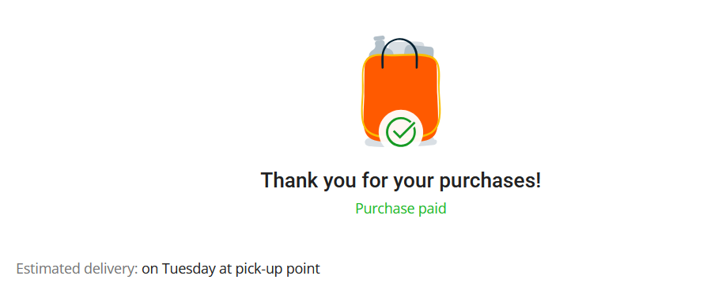
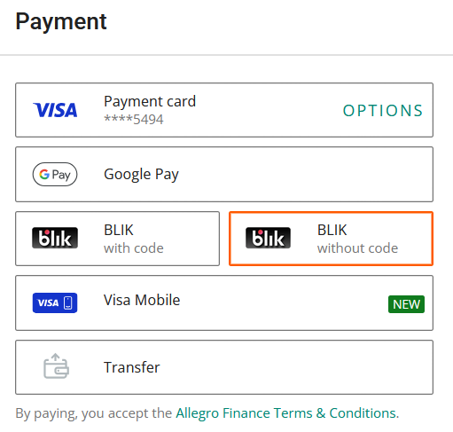
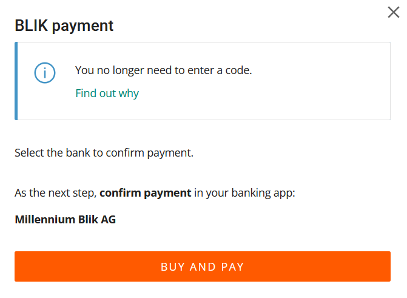

:::info
BLIK is a Polish mobile payment system, which allows you to easily transfer money through your bank’s mobile app. To learn more about BLIK, go to [BLIK documentation](https://www.blik.com/en/first-steps-with-blik).
:::

After you've selected your item(s) and provided delivery information, you can pay using BLIK with or without a code.

## With code

1. In the **Payment** section, select **BLIK with code**.

    

2. In the **Summary**, click **Pay with BLIK**. 

    

3. A **BLIK payment** window will appear. Generate a 6-digit BLIK code in your banking app and provide it.

4. Click **Buy and pay**.

    

5. Confirm the payment in your banking app.

    If the payment is successful, you'll see a *Thank you for your purchase(s)!* message and an estimated delivery date.

    

## Without code

1. In the **Payment** section, select **BLIK without code**.

    

2. In the **Summary**, click **Pay with BLIK**. 

    

3. A **BLIK payment** window will appear. Click **Buy and pay**.

    

4. Go to your banking app and confirm the payment.

    If the payment is successful, you'll see a *Thank you for your purchase(s)!* message and an estimated delivery date.