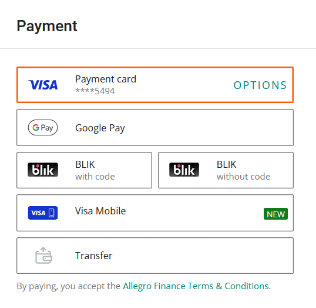
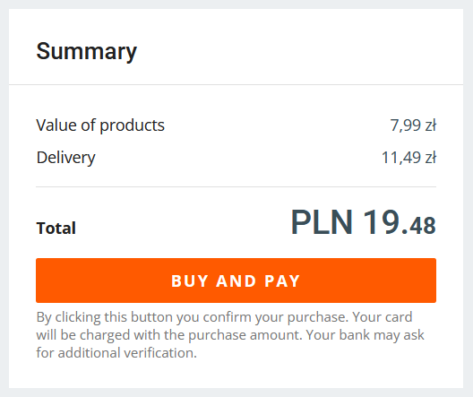

After you've selected your item(s) and provided delivery information, follow these steps to complete your purchase using a card:

1. In the **Payment** section, select **Payment card**.

    

:::info
To select a different payment card or add a new one, select **Options** and follow the instructions.  
:::

2. In the **Summary**, click **Buy and pay**. 

    

3. Your bank will ask you for an additional verification via a text message or a mobile app code. Verify the purchase.

    If the payment is successful, you'll see a *Thank you for your purchase(s)!* message and an estimated delivery date.

    