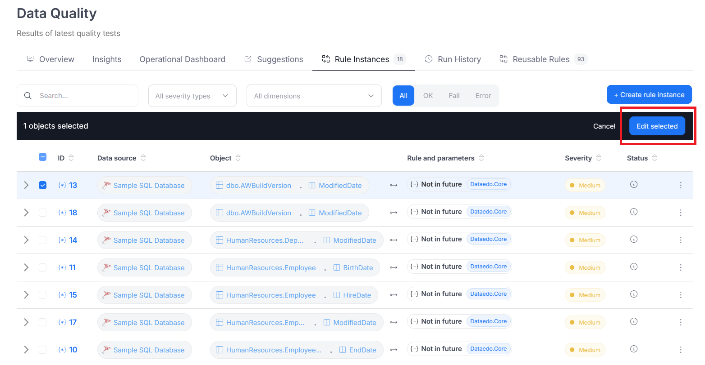
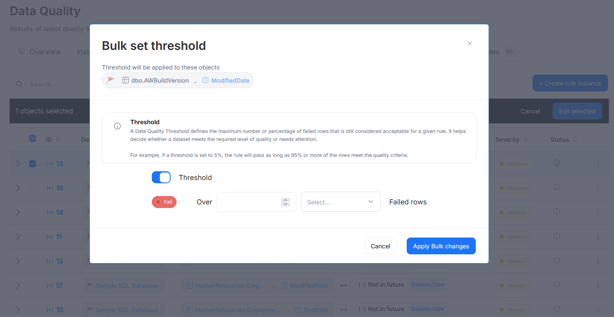

# Step 4: Set Threshold

By default, rule instances receive a *fail* status if any row doesn't meet the rule's quality criteria. However, in some cases, this might be too restrictive, as you may want to allow a small margin of error (for example, you may decide that it's good enough as long as fewer than 100 of the rows fail). That's why in the **Set Threshold** step, you can define a threshold that determines how many failed rows are acceptable before an instance gets a *fail* status.

To set a threshold, turn on the **Threshold** toggle, enter a value, and select one of the two options:

- **Percentage threshold**: The rule instance will fail if the number of failed rows exceeds a given percentage (e.g., 5%).

- **Number threshold**: The rule instance will fail if the number of failed rows exceeds a specific count (e.g., 100).

After saving a rule instance, you can edit its threshold at any time. You can also set it in bulk for multiple instances at once, which is especially useful for existing rules, as you don't need to edit each of them individually. To do that, navigate to the **Rule Instances** tab, select multiple instances, and click **Edit selected**.

A window will open where you can configure the threshold settings. To apply the settings, click **Apply Bulk changes**.

